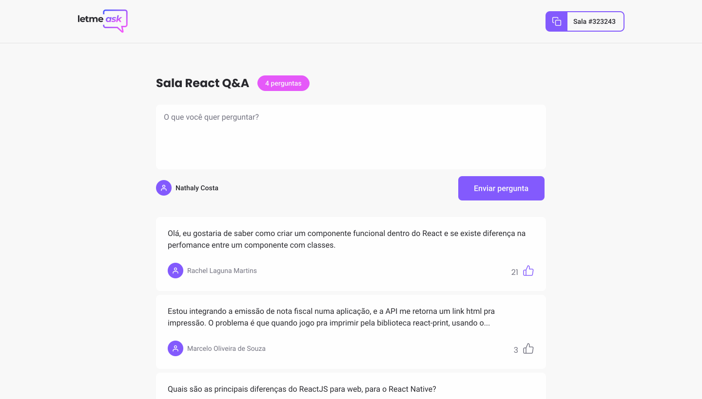

<h1 align="center"></h1>

  

## 📑 Description

An app where you can clear up your doubts with those who understand the subject, use it in your work meetings to clarify the matter or even join friends for a chat, why not?

## 🧰 Technologies

This project was developed with the following technologies:

- [React](https://reactjs.org/)
- [TypeScript](https://www.typescriptlang.org/)
- [Firebase](https://firebase.google.com/)

## 🧪 How to run

- Clone the repository
- Install dependencies with `yarn`
- Start the server with `yarn start`

Access from [`localhost:3000`](http://localhost:3000) your browser

---

Criado com orgulho durante o NLW Together 🚀
